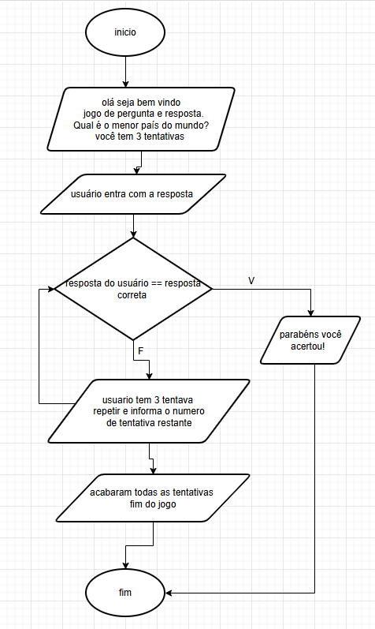

# ABPJ2-JOGOS-LOGICOS

## 📖 Descrição

- jogos de pergunta e respos. 
- a onde o usuario responde a pergunta gerada. 
---

## 🎯 Fluxograma

---

## 🛠️ Tecnologias Utilizadas
- Linguagem: Python 
- Ferramentas: VS Code, GitHub

## ⚙️ Como Executar o Projeto
o passo a passo para conseguir rodar o projeto.
1. Pré-requisitos
   vscode
   Python 3.10 ou superior instalado
   Git instalado

2. Instalação
   Clone o repositório:

   git clone [https://github.com/usuario/projeto.git](https://github.com/usuario/projeto.git)

   Acesse a pasta do projeto: 
   (cd nome-do-seu-repositorio)

3. Execute o programa:

 (python main.py)

---

## 🧪 Testes Realizados
vscode
Python 3.10 ou superior instalado
Git instalado

---

## 📚 Aprendizados
- Conceitos novos.
- Melhoria no raciocínio lógico.
- Uso de ferramentas como GitHub.

---
## 👩‍💻👨‍💻 Autores
Informe:
- Nome aluno(JJOHNATAN).
- Curso e disciplina (desenvolvimento web mobile; Python base).
